<br />
<p align="center">
  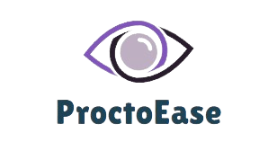
</p>

<p align="center">
  A straightforward framework built for automatic proctoring to create online tests, <i>effortlessly</i>.
  <br />
  <br />
  <a href="#table-of-content"><b>Explore the docs »</b></a>
  <br />
  <br />
  <a href="#architecture-and-design">Architecture</a>
  &nbsp;&nbsp;·&nbsp;&nbsp;
  <a href="#demonstration">Features</a>
  &nbsp;&nbsp;·&nbsp;&nbsp;
  <a href="#contributing">Local Setup</a>
  <br />
</p>

<br />
<br />

<p align="center">
  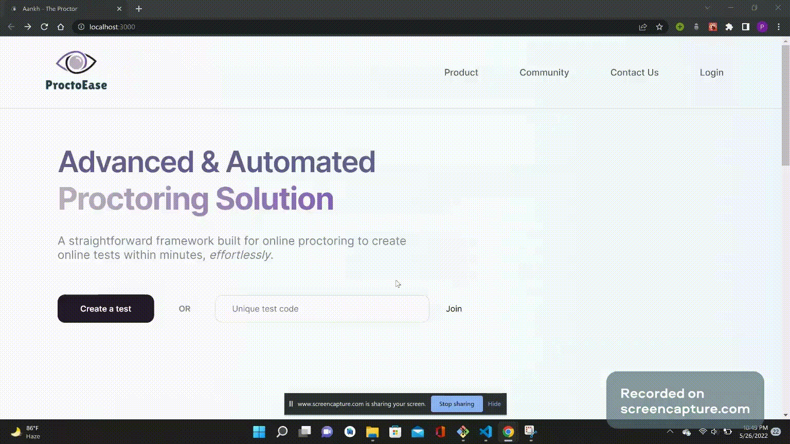
</p>

<br />

### Table Of Content

- [Architecture](#architecture-and-design)
- [Design](#design)
- [Demonstration & Features](#demonstration)
- [Technologies Used](#technologies-used)
- [Local Setup & Contributing](#contributing)
- [License](#license-)
- [Authors](#authors)


## Architecture and Design

<br />

### Architecture

- The architecture and workflow was built using [excalidraw](https://excalidraw.com) and it is freaking [brilliant](https://github.com/excalidraw/excalidraw).
<br />
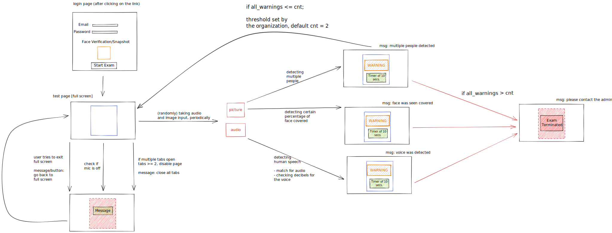
<br />

### Design

- The designs were built using [Figma](figma.com) and were brought to life with [React](https://beta.reactjs.org).


## Demonstration

<br />

**Landing Page**

<p align="left">
  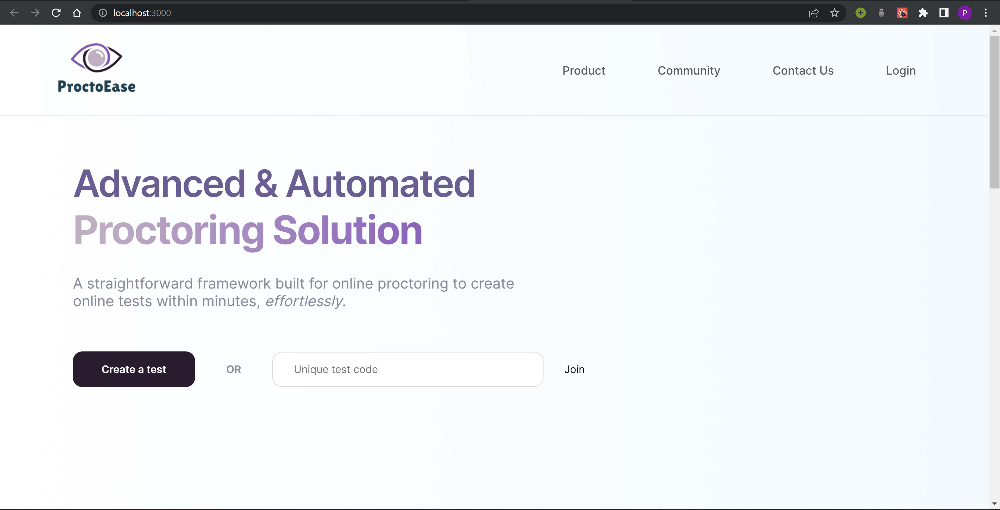
  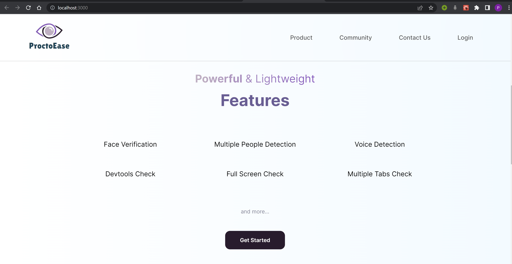
  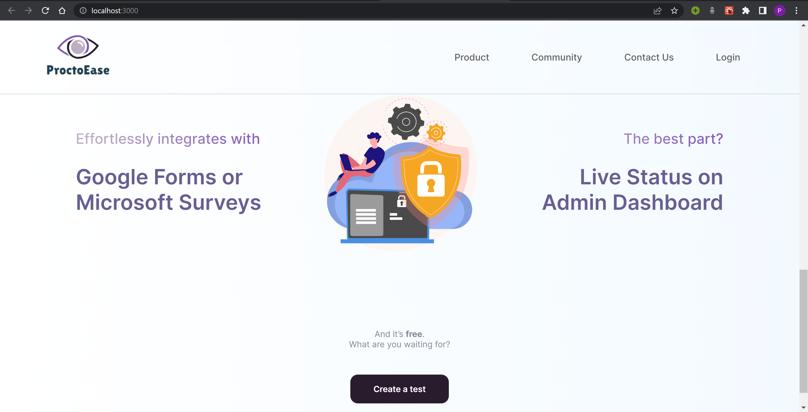
</p>

<br />
<br />


**Creating a Test and Dashbaord**


**Start Exam**

- After logging in and entering the unique test code.
- Live Snapshots will be captured, periodically and will be analysed for the following :
  -  Face Verification
  -  Face Cover/Visibility
  -  Multiple People Detection
<br />

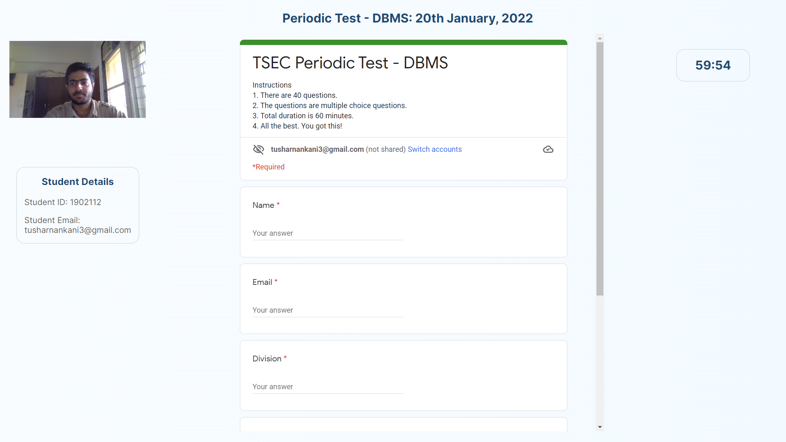
<br />


**Checks for cheating**

- Face Verification
- Voice Detection
- Multiple People Detection
- Dev Tools Check
- Multiple Tabs Check
- Full Screen Check
<!-- 
<br />

<table>
    <tr>
        <td>
            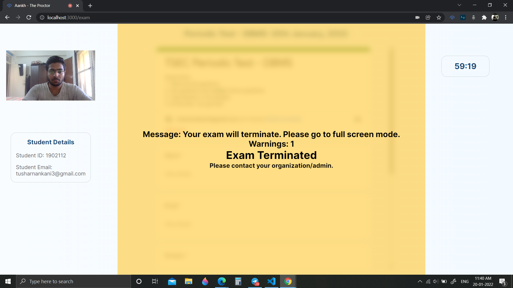
        </td>
        <td>
            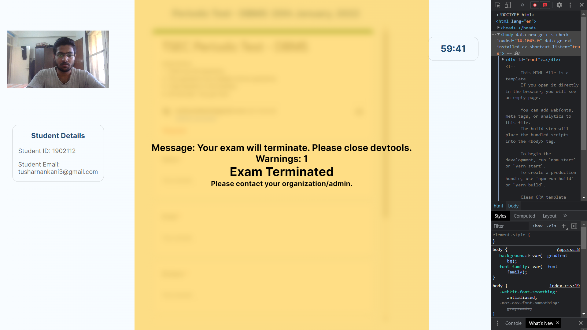
        </td>
    </tr>
    <tr>
        <td>
            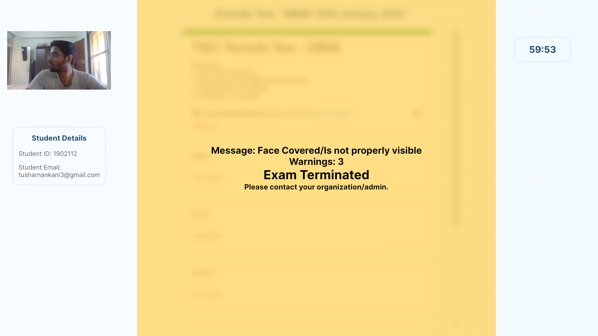
        </td>
        <td>
            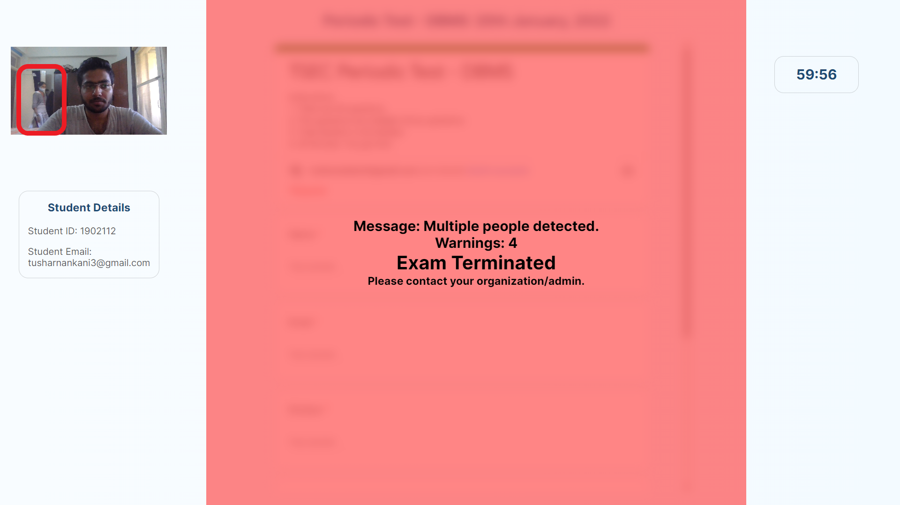
        </td>
    </tr>
</table>

<br /> -->

Also, **ideas rejected**: These were rejcted due to false positives and unsurity of cheating.

- Eye Tracking
- Object detection
- Mouse Tracking

<br />

<br />

## Technologies Used

<br />

- Workflow and Architecture Design
  - Excalidraw
- Prototyping and Frontend Design
  - Figma
- Frontend
  - React.js
  - CSS
- Backend
  - Node.js (Express.js)
  - MongoDB
- Machine Learning
  - OpenCV
  - Tensorflow_hub
  - Flask

<br />

**Dependencies**

A freaking huge shoutout to:
- [react-webcam](https://www.npmjs.com/package/react-webcam)
- [devtools-detect](https://www.npmjs.com/package/devtools-detect)
- [react-chartjs-2](https://www.npmjs.com/package/react-chartjs-2)
- [chartjs](https://www.npmjs.com/package/chartjs)

<br />
<br />

## Contributing

**Local Setup || Project Structure**

NOTE: Individual instructions can be found in respective directories.

- The project contains 4 broad directories.

```
*
├───client
├───extension
├───model
└───server
```

- `client`: The frontend for the application.
- `extension`: Chrome/Edge extension to keep a track of browser tabs.
- `model`: Model APIs for Machine Learning.
- `server`: The backend for the application.

<br />

**Client**

For local setup of frontend:
- `cd client`
- `npm i`
- `npm start`
- Go to `localhost:3000`

Structure

```
src
├───assets
├───components
├───containers
└───index.js
```

Individual Component & Container Structure

```
component
├───component.jsx
└───component.css
```

<br />
<br />

**Extension**

Read [this](https://github.com/tusharnankani/LeadsTracker#using-this-extension) or [this](https://github.com/dheerajdlalwani/back-to-work/#how-to-install) for a brief description for installing extensions.
- Open new tab & type: `chrome://extensions` or `edge://extensions`.
- Look for the Developer mode toggle & turn it on if it's not already.
- After cloning the repository, click on `Load Unpacked` and select the `extension` directory.

<br />
<br />

**Model**

The complete setup can be found in the [`model` directory](./model).

NOTE:

- Apart from this `tensorflow` and `tensorflow_hub` should be installed .
- The face-pose-estimation model is not final it is just a placeholder for now(will improve it as we get time).
- How to convert javascript array for image into image tensor that part is remaining.

<br />
<br />

**Server**

For local setup of backend:
- `cd server`
- `npm i`
- `npm start`

```
server
├───controllers
├───middlewares
├───models
├───routes
└───package.json
```

<br />
<br />

### License 📜

[GNU General Public License v3.0](/LICENSE)


### Authors

- Abhinay Patil 
  - [LinkedIn](https://www.linkedin.com/in/abhinay-patil-3b385422a/?locale=fr_FR)
- Piush Paul
  - [LinkedIn](https://www.linkedin.com/in/piush-paul-b40612208/)

